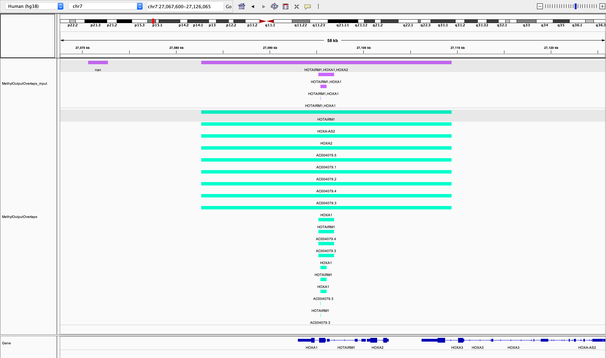

************
sci-epi2gene
************

Sci-epi2gene maps events annotated to a genome location to nearby genes - i.e. peaks from histone modification data
ChIP-seq experiemnts stored as bed data, or DNA methylation data in csv format (e.g. output from DMRseq or methylKit).

The user provides a SORTED gene annotation file with start, end, and direction for each gene (we recommend using
`sci-biomart <https://github.com/ArianeMora/scibiomart>`_, see examples for detail.

The user then selects how to annotate, i.e. whether it is in the promoter region, or overlaps the gene body. Finally,
the parameters for overlap on each side are chosen. This algorithm only runs through the file once, so should have
computational complexity of O(N).

It is available under the `GNU General Public License (Version 3) <https://www.gnu.org/licenses/gpl-3.0.en.html>`_.

This package is a wrapper that allows various epigenetic data types to be annoatated to genes.

I found that the Granges package annotated a peak to a gene (but not any other genes it may overlap) plus its in R
so enough said.

I also wanted to have different upper flanking and lower flanking distances that took into account the directionality of the strand
and also an easy output csv file that can be filtered and used in downstream analyses. This is why I keep all features
that fall within the annotation region of a gene (example below):

The overlapping methods are as follows:
    1) overlaps: this means does ANY part of the peak/feature overlap the gene body + some buffer before the TSS and some buffer on the non-TSS side
    2) promoter: does ANY part of the peak/feature overlap with the TSS of the gene taking into account buffers on either side of the TSS.

As you can see from the above screenshot using IGV, the input peaks are in purple, and the green are the output
peaks as annotated to genes. The function *convert_to_bed* converts the output csv to bed files for viewing. This example
shows that a peak/feature can be annotated to multiple genes. Peaks/features outside of the regions of genes (e.g.
the first peak) are dropped from the output.

We show this example in the :ref:`notebook <examples/notebook>`, where we use `IGV <https://github.com/igvteam/igv-jupyter#igvjs-jupyter-extension>`_
to view the tracks (see image below).

.. figure:: _static/igv_jupyter.png

Lastly, there are sometimes differences between annotations (i.e. the TSS on your annotation in IGV may differ to the
annotation you input to sciepi2gene), naturally, how your genes/features are annotated depends on the input file so if you see differences check this first!

Please post questions and issues related to sci-epi2gene on the `Issues <https://github.com/ArianeMora/sciepi2gene/issues>`_  section of the GitHub repository.

Running sci-epi2gene
=====================

1. Install sci-epi2gene (:ref:`Installing <installing>`)

2. View markdown examples in (:ref:`examples <examples/examples>`)

3. Look at an example notebook with output (:ref:`notebook <examples/notebook>`)

4. Look at CLI examples in (:ref:`cli <examples/cli>`)

Extending sci-epi2gene
======================

1. Make a pull request on github - we have made the code extendable to add specific data types for parsing simply over-ride
`_assign_values` and `update_loc_value` functions.

Citing sci-epi2gene
===================
Sci-epi2gene can be cited as in :ref:`references`, where we also provide citations for the used tools (e.g. numpy).

.. toctree::
   :caption: Getting started
   :maxdepth: 1

   about
   installing/index

.. toctree::
   :caption: Running sci-epi2gene
   :maxdepth: 1

   examples/examples
   examples/notebook
   examples/cli

.. toctree::
   :caption: About
   :maxdepth: 1

   faq
   changelog
   references
